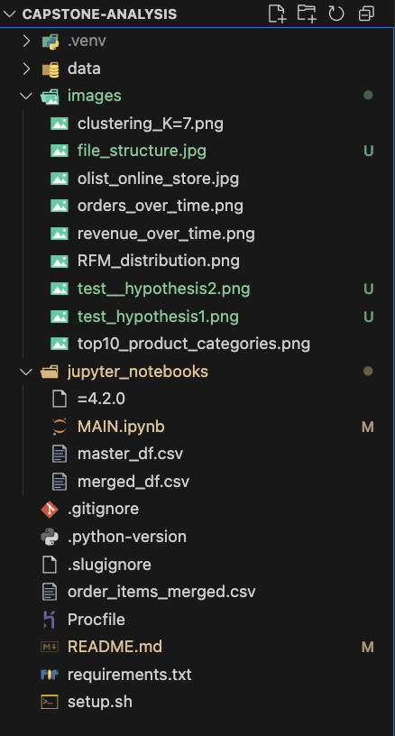
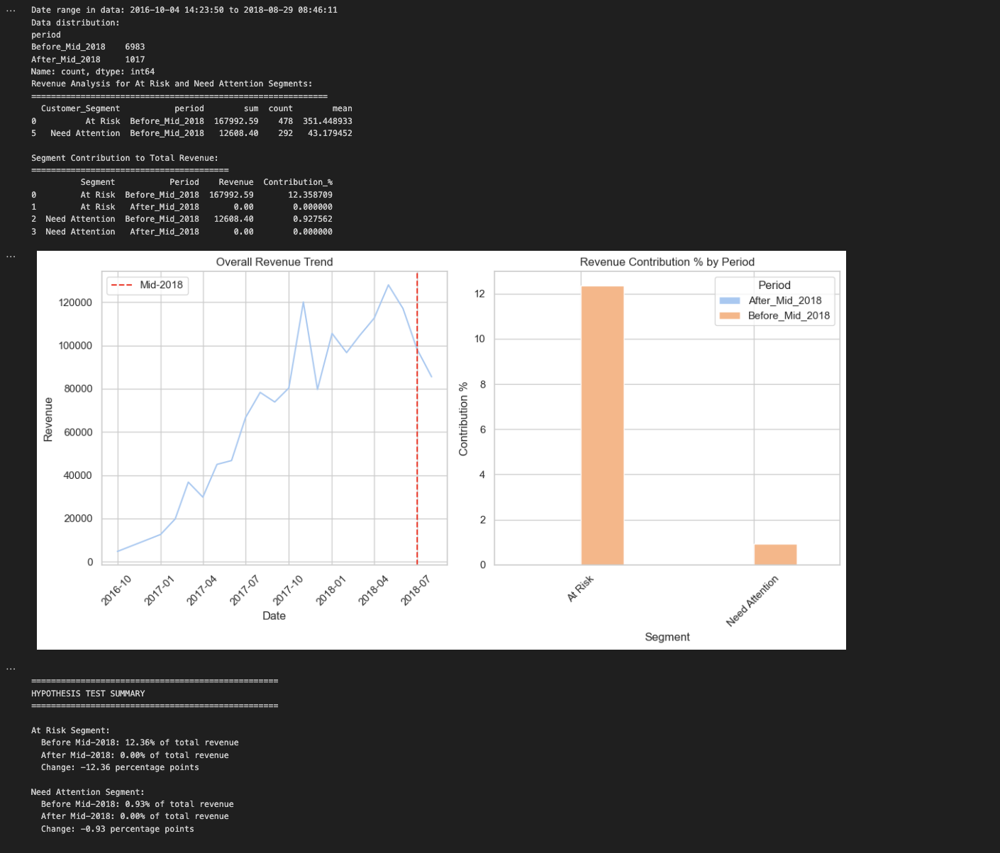
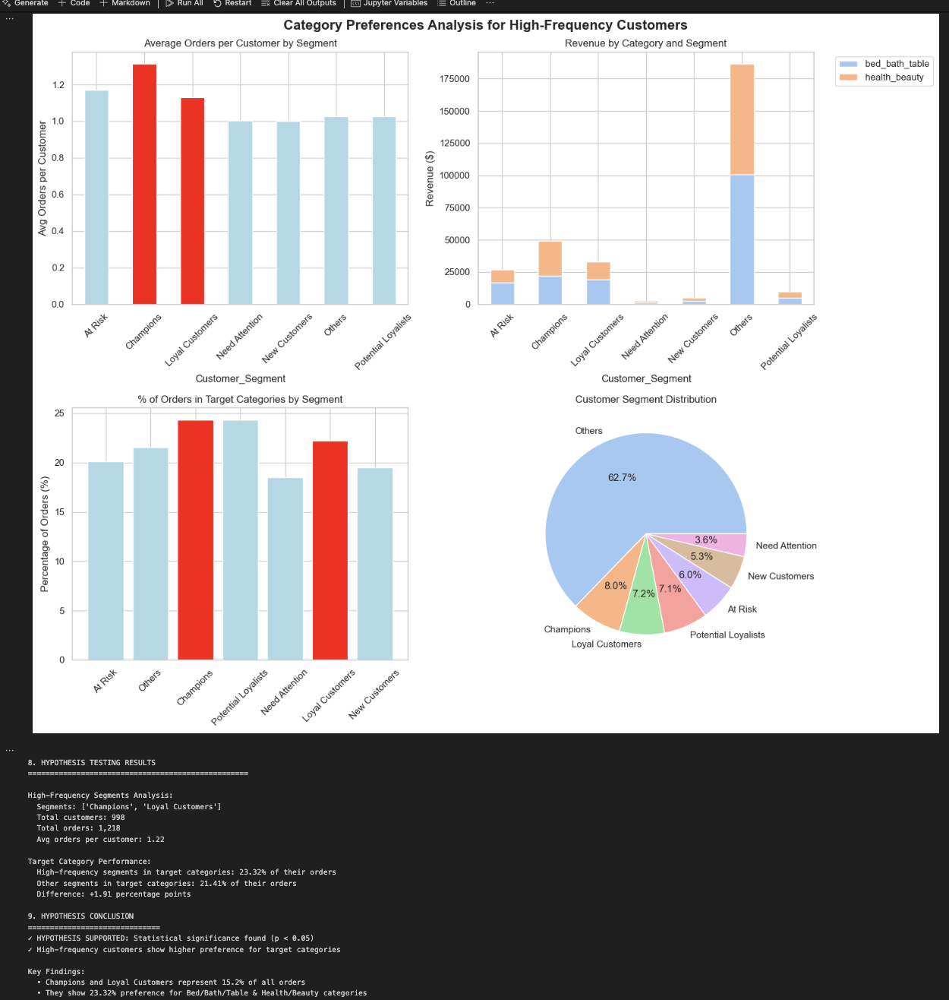
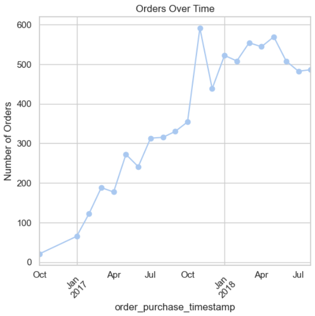
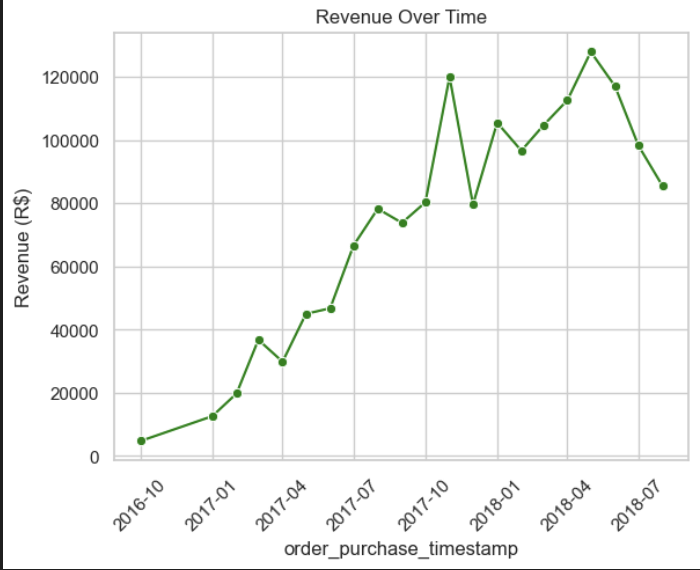
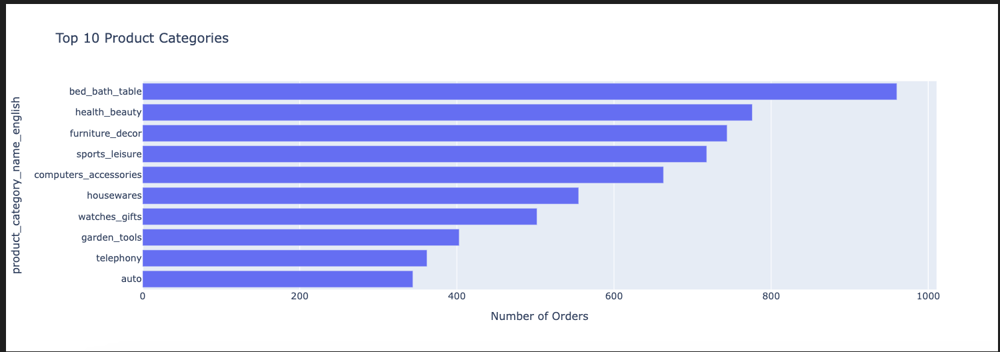
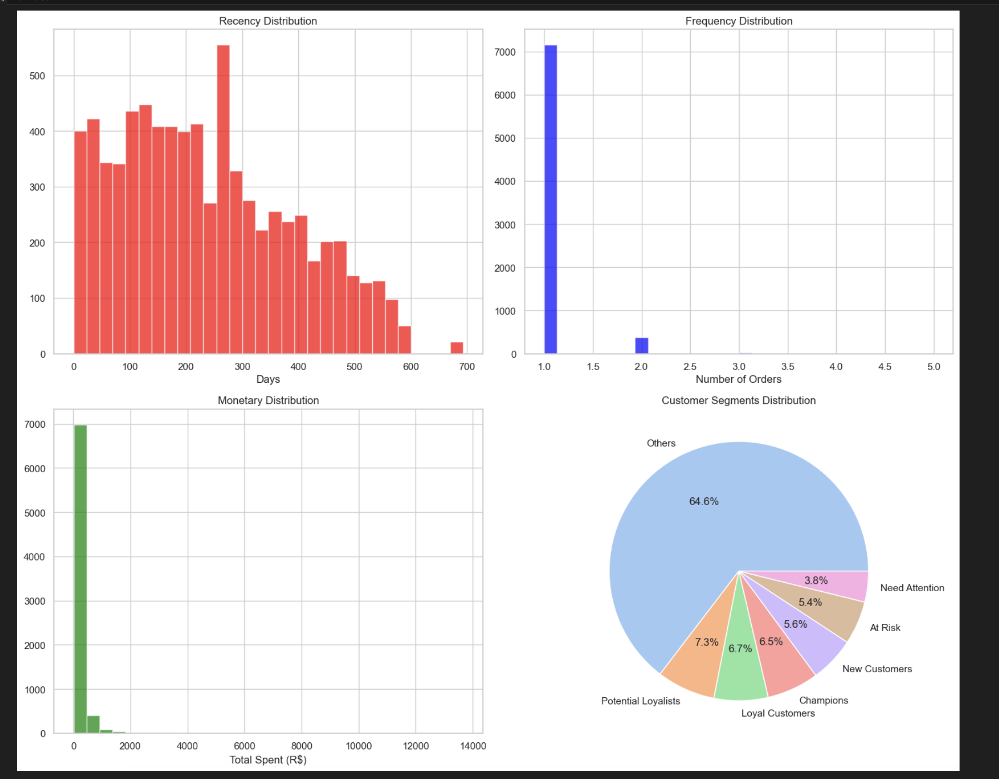
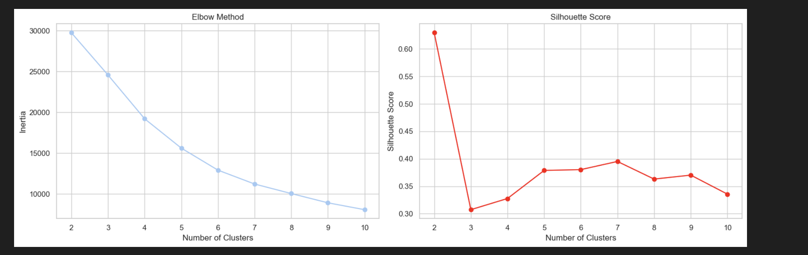

# Brazilian Olist Online Store Customer Consumption Behaviour Analysis

**Brazilian Olist Online Store Customer Consumption Behaviour Analysis** is an analysis that aim to explore customer information of 100k orders from 2016 to 2018 made at multiple marketplaces in Brazil. The data features allows viewing an order from multiple dimensions: from order status, price, payment and freight performance to customer location, product attributes and finally reviews written by customers.

## File Structure

The structure is based on business requirements

## Dataset Content
1. [Project Overview]

The dataset was found on Kaggle
 https://www.kaggle.com/datasets/olistbr/brazilian-ecommerce?select=product_category_name_translation.csv

The dataset contains 110180 rows and 39 columns. The dataset includes allows for a wide range of data, including variables such as order status, freight value and customer location.

The dataset is sampled to 8000 rows and 39 columns as Master Dataset for analysis.

## Business Requirements
The business goal of this analysis is to provide information to Brazilian Olist Online on how they can response to change in  customer behaviour  between 2016-2018 to adjust future marketing strategies according to trends and maximise profits of the store.

1.**Customer Consumption Data Analysis**: Utilizing datasets related to examine how different factors affects customer consumption based on Recency, Frequency and Monetary (RFM) patterns in Olist Store.

2.**Hypothesis Testing**: Validate assumptions about loyal and champion customers have high consumptions behaviour. 
Correlation of between customer segments and trends of orders. Identify key popular product categories 
 
3.**Major drivers identification**: Identify which attributes influence predictions the most.

4.**Present Interactive Dashboard**: Create impactful visualisation to provide key insights into Brazilian e-commerce customers consumption behaviour

## Hypothesis and Validation?

##H1

* Hypothesis 1: At Risk and Need Attention segments does not contribute to the revenue  after mid-2018.

  Validation with Summary:

* Hypothesis 2: Champions and Loyal Customers show significantly higher purchase frequency and preference for Bed/Bath/Table and Health/Beauty categories compared to other customer segments, indicating these categories drive customer loyalty and repeat purchases.

Validation with Summary: 

These will be examined and validate through statistical Python analyses and use of visualisations.

## Project Plan
-  A Kaggle dataset is selected from public domain: the Brazilian E-Commerce Public Dataset by Olist. The dataset contains comprehensive records of Olist, an online retail store in Brazil.
To ensure computational efficiency while maintaining analytical integrity, the dataset is cleaned and sampled down to 8,000 unique entries. This reduction aligns with the project scope and accurate data analytics performance requirements, ensuring manageable processing without significant loss of information.
- Setup a Kanban project board to record and track all tasks and milestones for the project.
-  Develop hypotheses to be tested and validated.
-  Carry out ETL and EDA on the dataset using Python in Jupyter Notebooks. To prepare the dataset for analysis and visualisation (including feature engineering, RFM analysis and clustering with the aid of generative AI)
-  Create visualisations in Jupyter Notebook using Seaborn, Matplotlib and Plotly.
-  Perform statistical testing in Jupyter Notebook.
-  Develop insights and conclusions from analysis.
-  Build dashboard in Tableau for data storytelling.
-  Evaluate project from ideation phase to dashboard creation.

A mixed-methods approach is deployed to explore Olist online store trends. A sample of 8000 records is analysed to balance performance with data integrity.

Python was used for data extraction, cleaning, exploratory analysis and statistical testing. 

## The rationale to map the business requirements to the Data Visualisations
Business Requirements
| Business Requirement             | Visualisation & Rationale                                    |
| -------------------------------- | ------------------------------------------------------------ |
| Identify Orders Over Time                 | **Matplotlib Line Chart**                           |
| Identify Revenue Over Time                | **Seaborn Line Chart**                              |
| Identify Top 10 product category          | **Plotly Bar Chart**                                |
| RFM Segementation and Analysis            | **Plotly Bar Charts**                               |
| Clustering analysis                       | **sklearn.cluster**                                 |
| Hypothesis Testing                        |**Line, Pieand  Bar Charts**                         |

Image Number 1 to 5 as the above table order:

 

 

 

 

## Analysis techniques used
### **Data Analysis Methods Used:**
- **Exploratory Data Analysis (EDA):** Identified trends in order over time, revenue over time,top 10 popular product categories

- **RFM Analysis and Segementation:** Grouped RFM scores and define customer segments based on customer_metrics includes recency, frequency and monetary.

- **Clustering** To validate hypothesis (Silhouette and Elbow method to determine the optimal number of clusters (k) in a dataset ).

- **Statistical Testing (T-Test, Customer and time metrics: Customer, Year, Sum, count and mean):** To validate hypotheses 
- **Tableau Data Visalisation Dashboard:** To provide interactive insights
-**Project planning, monitoring and evaluation: https://github.com/users/nitcode-cyber/projects/16
##Limitations##

1.The analysis relies on predefined customer segments, which may not fully capture dynamic customer behavior changes over time.
2.Limited to available categories and data, potentially missing unlisted preferences or external factors influencing purchase patterns.

Ethical considerations
-** The data has been anonymised at the source and does not present any immediate concerns regarding data privacy.

Dashboard Design
Tablaeu 
https://public.tableau.com/app/profile/ari.n4160/viz/Book2_17533674555920/Dashboard1?publish=yes

An interactive dashboard was created  to provide clear and accessible insights of the customer behaviour

Main Data Analysis Libraries

Acknowledgements

All the people supported me throughout teh project 

References
https://www.youtube.com/watch?v=g-h4Faao77M

https://www.youtube.com/watch?v=p8arik6ZyyI